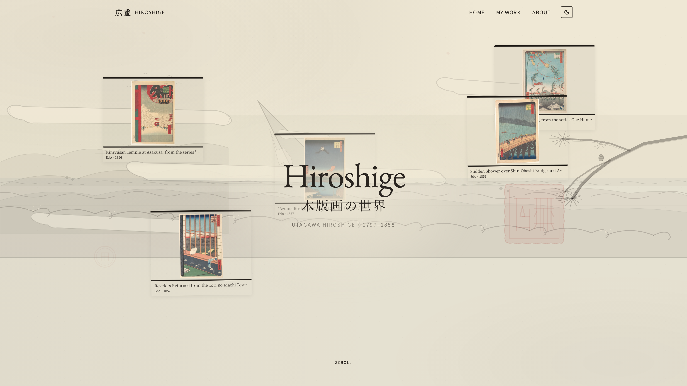
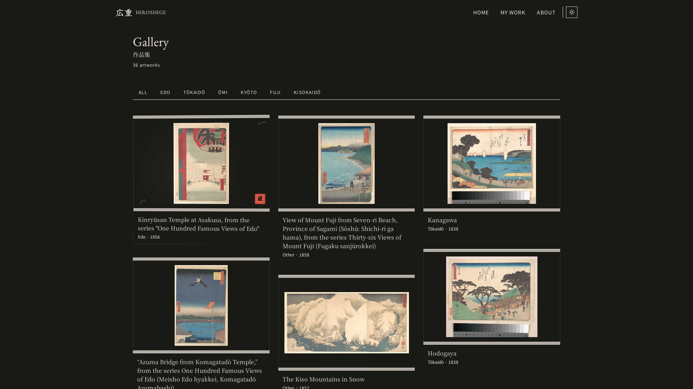
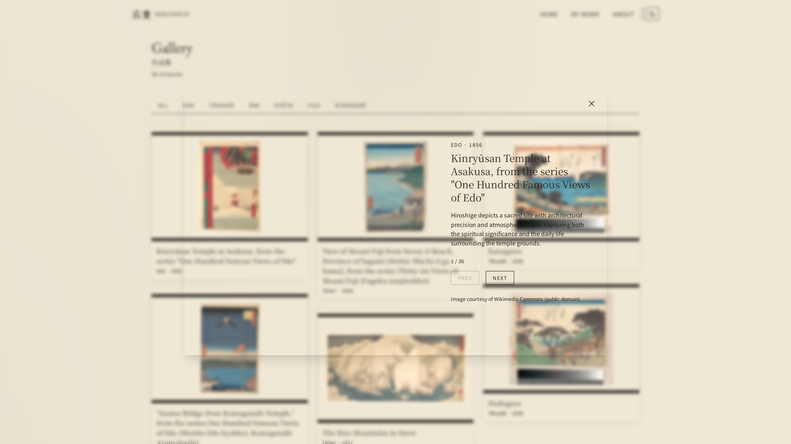
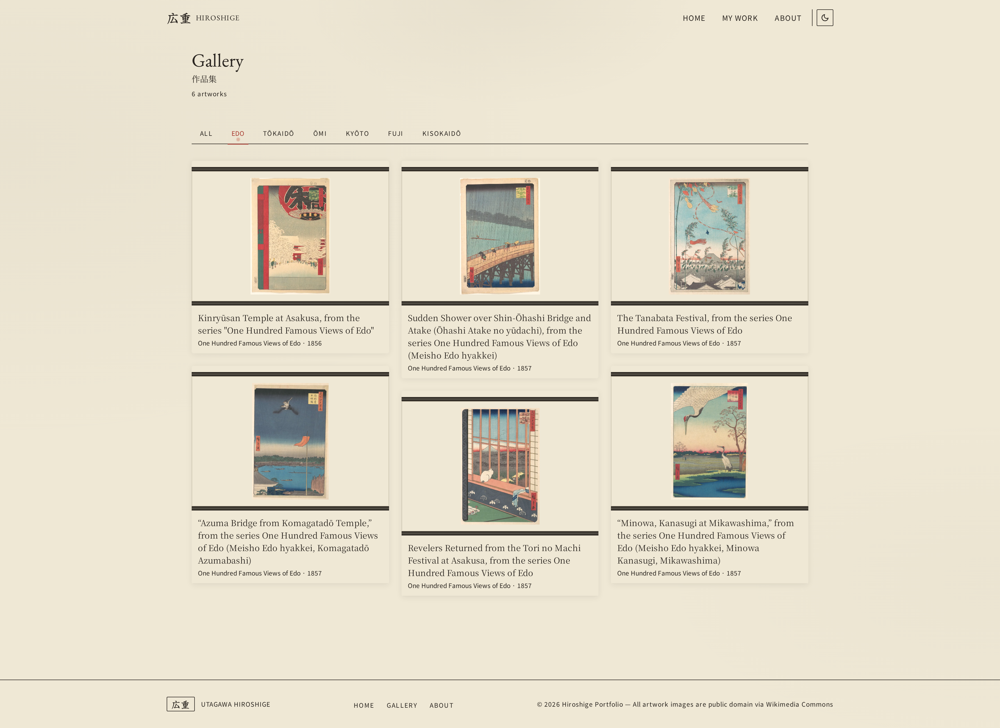
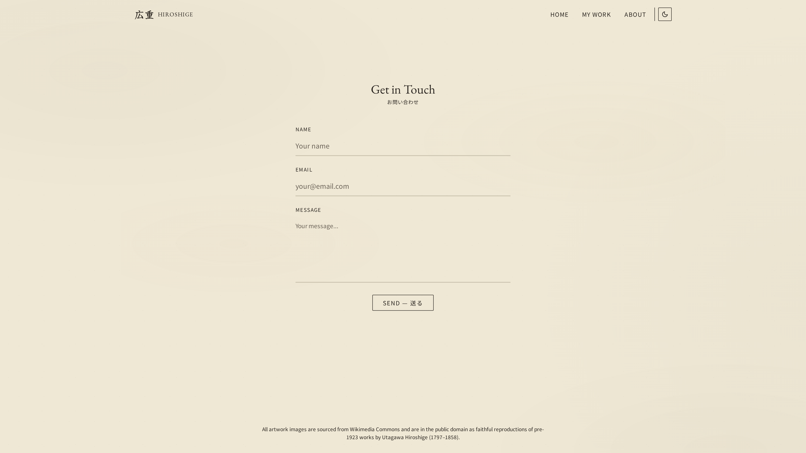
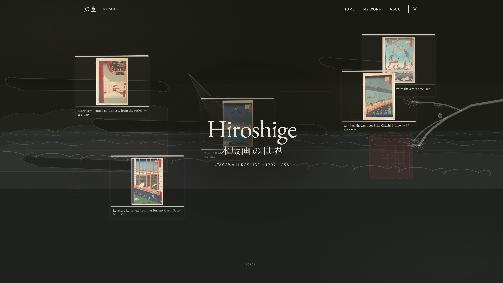

# Hiroshige Portfolio

An immersive digital gallery showcasing the woodblock print masterpieces of **Utagawa Hiroshige** (1797–1858), built with a sumi-e (ink wash) inspired design aesthetic.

Artwork images sourced from [The Metropolitan Museum of Art's Open Access collection](https://www.metmuseum.org/about-the-met/policies-and-documents/open-access) via Wikimedia Commons.

---

## Built with AM

This entire project was built collaboratively with **[AM](https://am.ai)** — an AI agent that handled architecture, implementation, testing, and iterative refinement through natural language conversation.

### How it was made

The project started with a design spec and was built incrementally through conversation with AM. No code was written by hand — every file was generated, reviewed, and refined by the AI agent based on human direction and feedback.

**Design & Architecture:**
- AM designed the Next.js App Router page structure, Express API routes, and SQLite schema
- Chose the tech stack (Tailwind + DaisyUI for theming, Framer Motion for animations, better-sqlite3 for the database)
- Established the component tree — 22 components across primitives, compositions, and page-level tiers
- Defined the TypeScript types shared between frontend and backend

**Implementation:**
- Generated every React component including the 2.5D parallax hero (`HeroParallax`), kakejiku scroll cards (`KakejikuCard`), full-screen lightbox, masonry gallery, filter bar, contact form, navigation, footer, custom cursor, scroll progress, page transitions, and the ink-wash background
- Built the Express server with 6 API endpoints (artworks CRUD, artist info, contact form submission)
- Wrote the SQLite schema, seed data (37 artworks from the Met Museum collection), and data fetching layer with client-side fallbacks
- Implemented light/dark theme system with localStorage persistence, custom sumi-e color palette in CSS variables, and a flash-of-wrong-theme prevention script

**Testing & Quality:**
- AM wrote all tests — Vitest unit tests for data fetching and server route integration tests using supertest
- Iteratively fixed failing tests and debugged issues (Vitest async mock deadlock, TypeScript strict mode errors, API response shape mismatches)
- Ran linting, type checking, and test suites to verify every change

**Design & Polish:**
- Contrast fixes were applied systematically — AM tested color combinations against WCAG AA standards and adjusted text opacity across the entire site
- The hero parallax backdrop opacity was tuned so titles remain readable over the busy 2.5D scene layers
- Animations were refined (ink-bleed easing curves, scroll-reveal variants, spring physics for hover effects)
- Dark mode colors were individually calibrated for each CSS variable

The entire process — from blank canvas to deployed site — was driven through natural language. AM wrote, tested, and refined every line of code.



---

## Features

### 2.5D Parallax Hero Scene
Six illustrated layers at different perspective depths create a diorama effect — distant mountains, clouds, waves, pine branch, and a vermillion seal — with mouse-driven parallax rotation and floating artwork cards.


### Kakejiku (Hanging Scroll) Cards
Japanese scroll aesthetic with wooden rods, mounting borders, and a tripartite hover animation: parallax tilt + ink-wash ripple + vermillion seal stamp bloom.



### Full-Screen Lightbox Gallery
High-resolution artwork viewer with series metadata, prev/next navigation, keyboard shortcuts (Escape, Arrow keys), and smooth transitions. Available on both the gallery page and homepage featured grid.



### Filterable Gallery
Filter Hiroshige's prints by series — *One Hundred Famous Views of Edo*, *Fifty-Three Stations of the Tōkaidō*, *Thirty-six Views of Mount Fuji*, *Eight Views of Ōmi*, *Famous Places of Kyōto*, and *The Sixty-nine Stations of the Kisokaidō* — with animated brushstroke underline tabs.



### Contact Form
Client- and server-validated contact form with scroll-reveal animations, loading states, and a Japanese kanji confirmation character on success.



### Light / Dark Mode
Full sumi-e palette adapts for both themes. Persisted to `localStorage` with an inline script to prevent flash of wrong theme.



### Custom Cursor
Canvas-based ink drip particle system — vermillion droplets with gold highlights that trail mouse movement.

### Additional Details
- Artist biography with kanji stamp decoration
- Interactive timeline of Hiroshige's life
- SVG brushstroke dividers (mountain, wave, bamboo variants)
- Scroll progress indicator with ink droplet
- Page transitions via Framer Motion
- Cherry blossom petal particles in the hero section
- Custom 404 page with Japanese aesthetic

---

## Tech Stack

| Layer | Technology |
|---|---|
| **Framework** | Next.js 14 (App Router) |
| **UI** | React 18 |
| **Styling** | Tailwind CSS 3 + DaisyUI 4 |
| **Animation** | Framer Motion 11 |
| **Backend** | Express 5 |
| **Database** | SQLite via better-sqlite3 |
| **Testing** | Vitest 4 + Supertest |
| **Language** | TypeScript 5 (strict) |

---

## Quick Start

```bash
# Install dependencies
npm install

# Seed the database (idempotent — safe to re-run)
npm run db:seed

# Start development (Next.js on :3000, API on :3001)
npm run dev
```

Open [http://localhost:3000](http://localhost:3000) in your browser.

### Other Commands

```bash
npm run dev:server     # API server only (tsx watch)
npm run build          # Production build
npm start              # Start production Next.js
npm run lint           # ESLint check
npm test               # Run all tests
npm run test:watch     # Tests in watch mode
npm run db:seed        # Reset seed data (restart server after)
```

---

## Project Structure

```
hiroshige-portfolio/
├── app/                    # Next.js App Router pages
│   ├── layout.tsx          # Root layout (nav, footer, theme, cursor)
│   ├── page.tsx            # Homepage — Server Component
│   ├── not-found.tsx       # Custom 404
│   ├── globals.css         # CSS variables & custom styles
│   ├── about/              # About & contact page
│   └── work/               # Gallery page
├── components/             # 22 React components
│   ├── HeroParallax.tsx    # 2.5D hero scene
│   ├── KakejikuCard.tsx    # Hanging scroll card
│   ├── Lightbox.tsx        # Full-screen artwork viewer
│   ├── GalleryMasonry.tsx  # Masonry grid layout
│   ├── FilterBar.tsx       # Series filter tabs
│   ├── ContactForm.tsx     # Contact form
│   ├── Navigation.tsx      # Site navigation
│   ├── Footer.tsx          # Site footer
│   └── ...                 # 14 more components
├── lib/                    # Data fetching, animations, helpers
├── hooks/                  # Custom React hooks (3)
├── types/                  # Shared TypeScript types
├── server/                 # Express backend (port 3001)
│   ├── index.ts            # Server entry
│   ├── db.ts               # SQLite connection
│   ├── schema.ts           # Table creation
│   ├── seed.ts             # 37 artwork seed data
│   ├── routes/             # API route handlers
│   └── __tests__/          # Server tests
├── public/                 # Static assets
│   └── images/artworks/    # Artwork images (full & thumb)
└── assets/scene-layers/    # SVG layers for hero parallax
```

---

## API Endpoints

| Endpoint | Method | Description |
|---|---|---|
| `/api/artworks` | GET | All artworks. Supports `?featured=true` and `?series=` |
| `/api/artworks/series` | GET | List of distinct series |
| `/api/artworks/series/:name` | GET | Filter by series |
| `/api/artworks/:id` | GET | Single artwork by ID |
| `/api/artist` | GET | Artist info + timeline |
| `/api/contact` | POST | Submit contact message |

---

## Design System

The sumi-e palette uses CSS custom properties with both hex values and RGB triplets for Tailwind opacity support. All colors adapt for dark mode via the `.dark` class.

| Token | Light | Dark | Usage |
|---|---|---|---|
| `--sumi` | `#2A2520` | `#E8E3DA` | Primary text, borders |
| `--washi` | `#EFE8D5` | `#1A1A14` | Background, card surfaces |
| `--vermillion` | `#A8382E` | `#E85A4A` | Accent (text/border only) |
| `--gold` | `#B8985C` | `#D4B85C` | Decorative only |
| `--mist` | `#6B6358` | `#8A8278` | Secondary/muted text |

**Typography:** EB Garamond (display), Noto Serif JP (Japanese headings), Noto Sans JP (body), Yuji Syuku (accent).

**Key rule:** Vermillion is text/border only (never background fill). Gold is decorative-only (never text).

---

## Adding Screenshots

The screenshots referenced above (in `screenshots/`) need to be captured from the running app. To generate them:

1. Run `npm run dev` and open `http://localhost:3000`
2. Capture the following views at 1920×1080 (or similar desktop resolution):
   - **Hero parallax** — the full hero section on the homepage
   - **Kakejiku hover** — hover over a featured artwork card
   - **Lightbox viewer** — click an artwork to open the lightbox
   - **Gallery filter** — the `/work` page with a filter selected
   - **Contact form** — the `/about` page scrolled to the contact form
   - **Dark mode** — toggle dark mode and capture any page
3. Place images in `screenshots/` matching the filenames in the README

---

## Testing

```bash
npm test                 # Run all tests
npm run test:coverage    # With coverage report
npm run test:watch       # Watch mode
```

Tests use Vitest with a Node environment (no jsdom — server/lib tests only). The test mocking pattern uses synchronous `vi.mock` factories with CommonJS helpers to avoid deadlock in Vitest 4.

---

## License

Artwork images are from [The Metropolitan Museum of Art](https://www.metmuseum.org/) under their Open Access policy (CC0). Code is available for reference and learning purposes.
